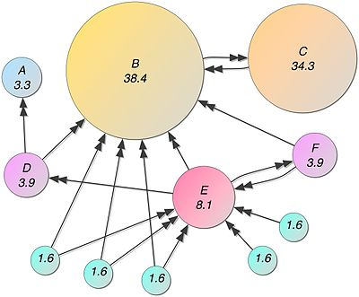

# Text-Summarization

Text rank algorithm is inspired from the famous Google’s PageRank algorithm. The underlying assumption of PageRank algorithm is that more important websites are likely to receive more links from other websites. It counts the number and quality of links to a page to determine a rough estimate of how important the website is. An illustrative image (taken from wikipedia) showing the importance of webpage can be seen below.

